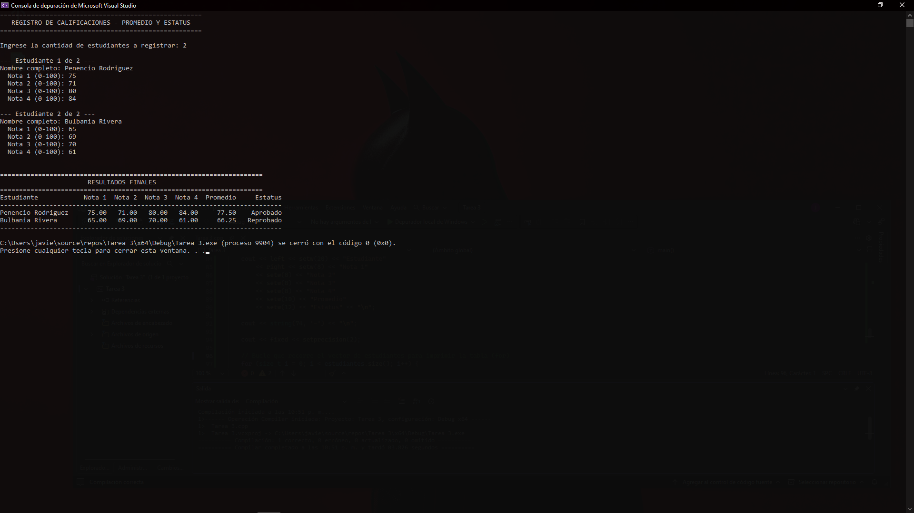
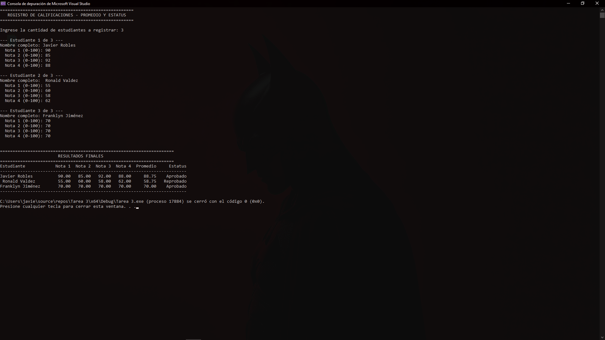

# -tarea3-flujo-control-2

# Actividad 3 – Flujo de Control Part. 2
### Promedio y Estatus de Estudiantes (usando bucles)

**Integrantes:** Javier José Robles Cano (2025-3729) · Ronald Valdez (2025-1402) · Franklyn Jiménez (2026-0669)
**Materia:** Lógica de Programación
**Profesor:** Ing. Gamalier Reyes del Carmen

---

## Resumen

Este programa, escrito en C++, utiliza **bucles (`for`)** para leer el nombre y las 4
calificaciones de una cantidad "n" de estudiantes (definida por el usuario). Por cada
estudiante calcula el promedio de sus notas y determina si **Aprobó** o **Reprobó**,
usando 70 puntos como nota mínima aprobatoria.

Al finalizar la captura de datos, el programa imprime una **tabla formateada con
tabulación** (usando `setw` de la librería `<iomanip>`) que muestra: el nombre del
estudiante, sus 4 notas, el promedio calculado y el estatus final, tal como se pide en
el enunciado de la actividad.

### Estructuras de control y bucles utilizados

- **Bucle `for` externo:** recorre la cantidad total de estudiantes ingresada por el
  usuario, repitiendo la captura de datos para cada uno.
- **Bucle `for` interno (anidado):** recorre las 4 calificaciones de cada estudiante,
  solicitándolas una por una y acumulando la suma para el promedio.
- **Condicional `if / else`:** determina si el promedio obtenido corresponde a
  "Aprobado" o "Reprobado" (nota mínima: 70).
- **Bucle `for` de impresión:** recorre nuevamente todos los estudiantes ya
  procesados para imprimir la tabla final de resultados.
- **Tabulación con `setw` / `setprecision`:** utilizada para alinear las columnas de
  la tabla (nombre, 4 notas, promedio y estatus) y mostrar los promedios con 2
  decimales.

## Cómo compilar y ejecutar

```bash
g++ -o promedio_estudiantes promedio_estudiantes.cpp
./promedio_estudiantes
```

## Capturas de pantalla del programa en ejecución

### Caso 1: Dos estudiantes (ejemplo del enunciado — un aprobado y un reprobado)


### Caso 2: Tres estudiantes (distintos escenarios, incluyendo nota límite de 70)

